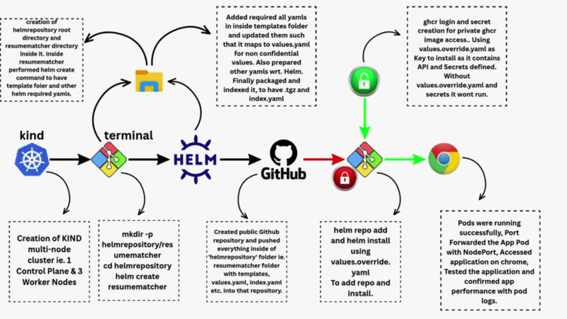

## Helm Package Management for Resume Matcher

Automating Kubernetes deployments using Helm charts. Managing releases, templates, and chart lifecycles for scalable applications.

## Access the walkthrough

[Watch the YouTube Video](https://www.youtube.com/watch?v=FpXploqjdEs)

---

# 🛠 Deployment Strategy

# Step 1: Cluster Creation

A multi‑node Kind cluster was created using `kind-node.yaml` configuration. The config defined one control‑plane and three worker nodes, with custom networking subnets:

`kind: Cluster
apiVersion: kind.x-k8s.io/v1alpha4
networking:
  disableDefaultCNI: false
  podSubnet: "10.244.0.0/16"
  serviceSubnet: "10.96.0.0/12"`
`nodes:`
  `- role: control-plane`
  `- role: worker`
  `- role: worker`
  `- role: worker`
  
Cluster creation was triggered with:

`kind.exe create cluster --name kind-node \
  --config kind-node.yaml \
  --image kindest/node:v1.27.3`

Observation: Initially, all nodes appeared in `NotReady` state. Within ~1 minute, they transitioned to `Ready`, confirming a healthy 4‑node cluster.

# Step 2: Chart Creation & Structure

Initiated the Helm workflow by creating a dedicated directory structure for the application. Executed the following commands to set up the workspace:

`mkdir -p helmrepository/resumematcher`
`cd helmrepository`
`helm create resumematcher`

The `helm create` command generated the standard scaffolding required for Kubernetes packaging, including the `templates/` directory for manifest files, `Chart.yaml` for metadata, and `values.yaml` for default configuration parameters.

# Step 3: Template Customization.

Customized the Helm chart by refining the `templates/` directory. This involved defining core Kubernetes manifests—such as `deployment.yaml`, `service.yaml`, and persistent volume claims—to ensure modular and reusable infrastructure as code.

Configuration Management
Used `values.yaml` to parameterize the deployment, allowing for flexible configuration of replicas, image tags, and resource requests. To maintain clean overrides, a `values.override.yaml` file was implemented for environment-specific settings:

`# values.override.yaml provides specific environment configurations`
`# to maintain clean base manifests in values.yaml`

Database Initialization
Configured a ConfigMap within the Helm values to automate database initialization. This includes a robust `initSql` block that ensures the necessary `PostgreSQL` extensions (like pgvector) are enabled and required tables are created if they do not exist, including logic for safe schema updates and data integrity via SQL rules.

# Step 4: Release Management

The final phase involved packaging the Helm chart into a distributable format and automating its hosting. Key technical steps included:

- Packaging: Used helm `package resumematcher` to compile the chart into a `.tgz` artifact.
- Indexing: Executed `helm repo` index to generate the necessary repository metadata, pointing to my GitHub Pages URL.
- Repository Isolation: Utilized `git subtree split` to create a separate `helmrepo-branch`. This ensured that the Helm repository remained clean and separated from the main application codebase.
- Deployment: Pushed the isolated branch to a dedicated repository and configured GitHub Pages. The site is now live, with the build process automatically managed by GitHub’s Pages deployment workflow.

# Step 5: Advanced Configuration & Deployment Verification

The deployment phase identified a critical dependency: the application images were hosted in a private GitHub Container Registry (GHCR). Initially, pods remained in a Pending state due to authorization errors during the image pull process.

Authentication & Private Registry Access

- GHCR Authentication: To resolve the image pull failure, I authenticated the Docker client with the GitHub Container Registry using the CLI:
`docker login ghcr.io -u [USERNAME] -p [GITHUB_TOKEN]`

- Secret Creation: To allow Kubernetes to pull images from the private registry, I created a registry secret within the cluster:
`kubectl create secret docker-registry ghcr-secret \`
  `--docker-server=ghcr.io \
  --docker-username=[USERNAME] \
  --docker-password=[GITHUB_TOKEN]`
  
This secret was then referenced in the `values.yaml` file under `imagePullSecrets`, enabling the pods to transition from `Pending` to `Running` status.

Functional Testing & Validation

- Service Access: With the images successfully pulled, I utilized port-forwarding to bridge the local environment to the cluster service:
`kubectl port-forward svc/resumematcher-service 8080:3000`

- End-to-End Testing: I conducted a live test by uploading a resume to the application interface. The application successfully triggered the embedding logic and performed a semantic match against the PostgreSQL database.

- Log-Based Confirmation: The successful operation was verified via the container logs:
`kubectl logs -f [pod-name]`

The logs provided definitive proof of the system's operational status: the connection to `resumematcher-db` was verified, table schemas were confirmed as initialized, and successful HTTP 200 responses for `/api/resumes` requests confirmed that the complete Helm-managed architecture was fully functional.

By addressing the private registry authentication and verifying the runtime logs, I ensured that the Helm-based infrastructure is not only automated but also secure and production-ready.

# 📝 Notes
* **Helm:** Efficient packaging and lifecycle management.
* **Infrastructure as Code:** Standardized, repeatable manifest deployment.
* **Authentication:** Secure integration with private container registries.
* **Outcome:** Successfully deployed a production-ready application architecture using Helm.
